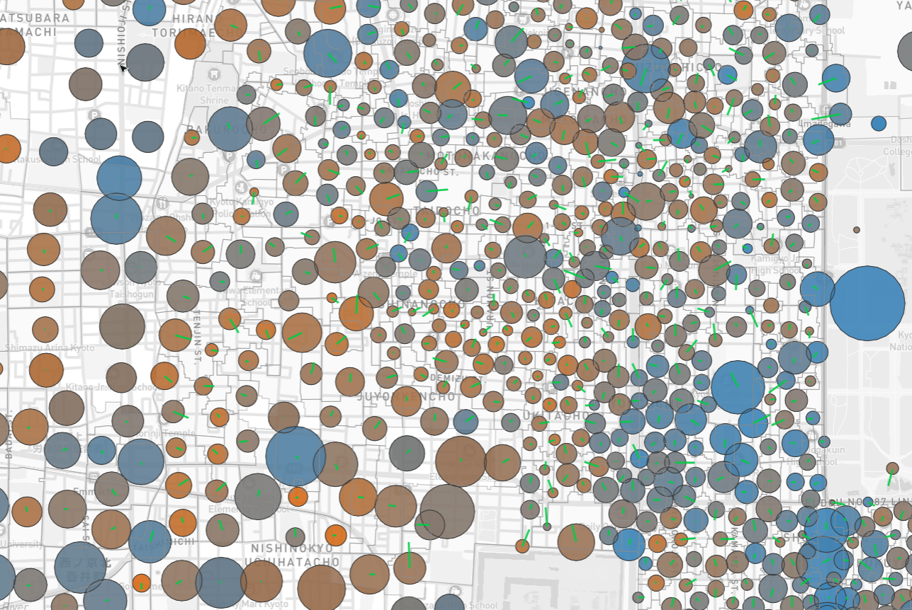
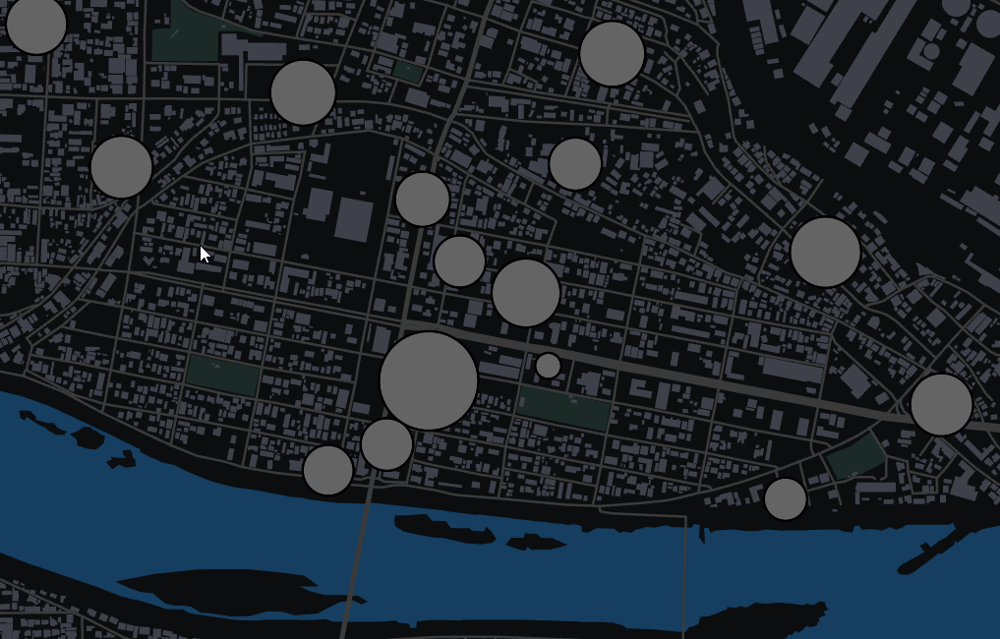
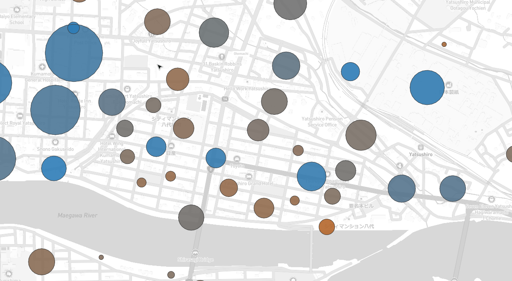
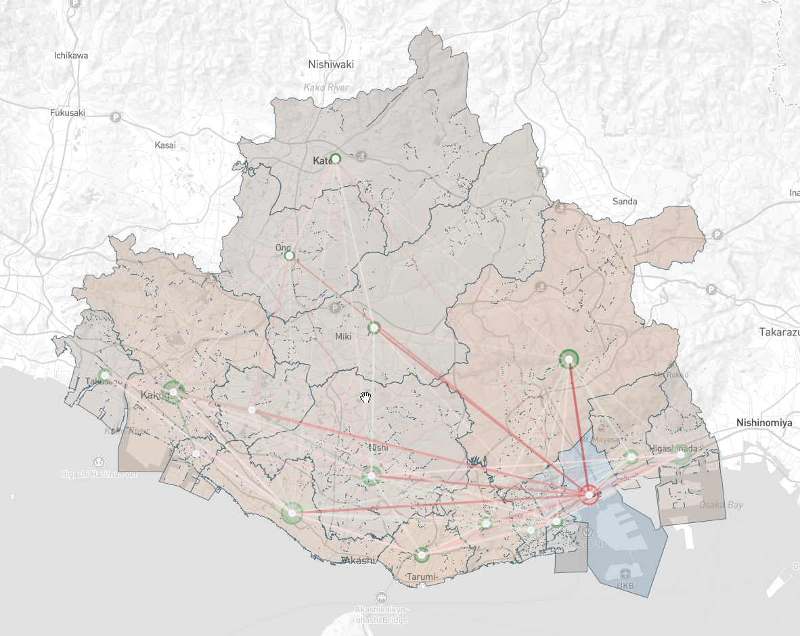

# Summary

Each map is limited to the metropolitan area (都市圏) around one or more major Japanese cities. Metropolitan area bounds are taken from the 2015 (csis.u-tokyo.ac.jp) 大都市雇用圏 dataset, with updates to ensure present-day administrative borders are honored

## Features

- High level of detail, with sub-250m population placements in dense areas.
- Spatial realism -- points are assigned in a manner that is aware of water features and mesh-weighted
- Special demand from several sources is also modeled
  - **Airports**
    - Demand based on annualized passenger statistics, split by international & national travelers
  - **Ports**
    - Demand based on annualized passenger statistics
  - **Hospitals**
    - Demand based on heuristic of reported bed capacity and known prefectural inpatient bed usage and outpatient visitation rates
  - **Institutions of Learning**
    - Students in primary education (小学校・中学校) (clipped to school districts)
    - Students in secondary education (高等学校) (sized by overall municipal enrollment)
    - Students in post-secondary (大学・短期大学) (sized by real enrollment figures)
  - **Cultural Attractions**
    - Attendance figures + candidate institutions sourced from prefectural/municipal reports (e.g. [山口県の宿泊者及び観光客の動向](https://www.pref.yamaguchi.lg.jp/uploaded/life/217842_497518_misc.pdf))
    - Zoos / Botanical Gardens / Aquariums (動物園・植物園・水族館)
    - Art & History Museums (美術館・博物館)
    - Parks / Sports Facilities / Stadiums (公園・運動公園・総合運動公園・スタジアム・競技場)
    - Major shrines/temples + landmarks (神社・寺・世界遺産・国宝)
- OSRM routing included
- Building depth is default to -10m, with train-related infrastructure exempt

## High-Level Methodology

Resident + Commuter totals are approximated using employed persons / workers (就業者数・従業者数) counts per (小地域) augmented by 500m (labor) and 250/100m (resident + approximate population) meshes to achieve sub-小地域 level point placement. Population counts by 小地域 are conserved, and point balancing is done through a mesh (population/worker) aware loss function

Gravity model is augmented by known O/D commute patterns by designated city ward (区) or municipality (市町村) to realistically simulate macro-level commute data in the absence of true O/D pairs

## Primary Data Sources

- 令和2年国勢調査 (e-stat.go.jp)
- 令和3年経済センサス (e-stat.go.jp)
- 国土数値情報 (nlftp.mlit.go.jp)
- 大学ポートレート(shigaku.go.jp + niad.ac.jp)
- 学校基本調査 (mext.go.jp)
- 観光統計 (statistics.jnto.go.jp)
- 「海しるAPI」 (portal.msil.go.jp) | J-EGG500 (jodc.go.jp)

## Issues/Questions

Please raise an issue on this repository or reach out to me directly on the pack's dedicated [thread](https://discord.com/channels/1420846272545296470/1479686112896356605) for any issues.
Suggestions are greatly appreciated and I will do my best to accommodate requests (so long as they are reasonable).

# Changelog

## 0.3.7 (2026-04-17)

### Major Map Updates

- `KCZ` - 高知 (Kōchi)
- `MYJ` - 松山 (Matsuyama)
- `OKA` - 沖縄 (Okinawa)
- `SPK` - 札幌 (Sapporo)
- `UKY` - 京都 (Kyōto)

### New Features

- FAll updated maps received significant reworks to include:
  - Attractions-based demand (~3-7% of total demand)
  - Bathymetric data from J-EGG500 + MSIL as well
  - Neighborhood labels
  - Overture sourced buildings
- SPK (札幌) updated to extend southeast to 苫小牧 (Tomakomai) as well as northeast to 岩見沢 (Iwamizawa)
- Initial point seeding is made aware of cross-町丁 points
  - Additional point repulsion pass added at this part of the pipeline which should reduce crowding in dense areas (e.g. 福岡 (Fukuoka) center)
- Point seeding is also aware of elongated 町丁 shapes.
  - 町丁 with high aspect ratios are now force seeded with multiple points so that individual points do not represent extreme spatial distance

### Other Updates

- Fixed designated city ward mapping to be consistent with other municipal labels (e.g. 神戸市中央区|Kōbeshichūōku => 中央区｜Chūō-Ku)

**Cross 町丁 repulsion**

**Elongated 町丁 handling (Before)**

**Elongated 町丁 handling (After)**

# Changelog

## 0.3.6 (2026-04-16)

### New Cities

- `FOKK` - 福北 / Fukuhoku (福岡(Fukuoka)・北九州(Kitakyūshū))
- `HNA` - 盛岡 / Morioka
- `KMJ` - 熊本 / Kumamoto
- `TTJ` - 鳥取 / Tottori

### Major Map Updates

- `FUK` - 福岡 (Fukuoka)
- `HKD` - 函館 (Hakodate)
- `KKJ` - 北九州 (Kitakyūshū)
- `IZO` - 中海 (Nakaumi)

### Minor Map Updates

- `AKJ` - 旭川 (Asahikawa)
- `AOJ` - 津軽 (Tsugaru)
- `FKS` - 中通り / Nakadōri
- `SHB` - 根室 / Nemuro
- `WKJ` - 稚内 / Wakkanai

### New Features

- All updated maps received new bathymetric data from J-EGG500 + MSIL as well as neighborhood labels + Overture sourced buildings
  - Four existing older maps (FUK, HKD, KKJ, IZO) received significant reworks to include attractions-based demand (~3-10% of total demand)
  - Three existing newer maps (AKJ, AOJ, FKS) + test maps (SHB, WKJ) received minor updates as they already had attractions-based demand included, but received new bathymetric data and Overture sourced buildings
- Added distance / city-scale aware driving time penalty to OSRM routing to make it less optimistic
- Standardized research process for determining attraction demand (e.g. attendance figures / municipal or prefectural reports) to be applied across all maps moving forward

### Other Updates

- Integrated repository with future standardized special demand tagging format
- Added map description template (now standard for all `registry` maps) along with preview images

## 0.3.5 (2026-04-12)

### New Cities (for testing only)

- `SHB` - 根室 / Nemuro
- `WKJ` - 稚内 / Wakkanai

### Other Updates

## 0.3.4 (2026-04-08)

### New Features

- Switched to Overture for buildings generation
- Added per-tile building / water stitching to .pmtiles so that rendering becomes much less taxing at lower zoom

### Other Updates

- 名古屋 (Nagoya) and 大阪 (Ōsaka) updated to test new optimizations

## 0.3.3 (2026-04-05)

### New Cities

- `AKJ` - 旭川 / Asahikawa
- `AOJ` - 津軽 / Tsugaru (青森(Aomori)・弘前(Hirosaki))
- `FKS` - 中通り / Nakadōri (福島(Fukushima)・郡山(Kōriyama))
- `FSZ` - 静岡・浜松 / Shizuoka・Hamamatsu

### Reworks

- `HIJ` - 広島 (Hiroshima) expanded to include 東広島・岩国 (Higashihiroshima + Iwakuni)

### New Features

- Added demand from custom attractions (e.g. major parks, sports venues, cultural icons)
  - Primarily sourced from prefectural / municipal documents related to annual reports/national censuses
- Added bathymetric data from J-EGG500 + MSIL to add ocean foundations layers for new and reworked maps

### Other Updates

- Added reconciliation of 小地域 (small boundary area) job counts vs. 500m job mesh to reduce outliers (e.g. high concentration of workers near a certain set of rice fields)
  - Will be applied to all new maps + reworks moving forward

### Images

**Bathymetric Data**

**Custom Attractions**

## 0.3.2 (2026-03-27)

### New Cities

- `NGO` - 名古屋 / Nagoya

### Other Updates

- Demand data post-processing made more aggressive (reducing precision to reduce overall data size).
  - As a result 大阪 / Ōsaka should also be even less demanding on the game.

## 0.3.1 (2026-03-25)

### New Features

- Buildings index for 大阪 / Ōsaka significantly reduced to improve playability / renderer OOM crashes.
  - Renderer now crashes with exit code `0x8B1D` which suggests playing the map with GPU rasterization off will help improve stability

### Other Updates

- Updating building processing filter to more aggressively prune small buildings with multiple polygons

## 0.3.0 (2026-03-22)

### New Cities

- `ITM` - 大阪 / Ōsaka
- `OKJ` - 岡山 / Okayama

### New Features

- Added demand for ~110 universities/technical colleges with no matching enrollment data (totalling ~140k students)
- Added demand for ~70 aquariums / zoos / botanical gardens

### Other Updates

- Rebalanced overall population to be logarithmic mean of (employed persons / workers) for consistency
  - Most cities should see a ~5-10% increase in total population as a result
- Rebalanced min/max demand totals for individual points based on overall metropolitan area size
  - Smaller, less dense metropolitan areas (e.g. 山形・函館・高知) will see greater point density as a result
  - Larger, already dense metropolitan areas (e.g. 神戸・福岡) should see very little change
- Point seeding algorithm now takes into account 100m mesh population estimates to avoid placing resident point in areas with no buildings
  - Most apparent in highly rural areas of the map
- Added final point/displacement/agglomeration algorithm to reduce very dense point spacing in urban centers

### Bugfixes

- Removed fixed-order origin point assignment in O/D calculation assignment causing significant "skew" in municipality origins for large destination points
  - This fix also signifcantly reduces the share of municipal O/D misalignment going to the smallest municipalities

### Images

**Municipal O/D Diagram**

## 0.2.0 (2026-03-15)

### New Cities

- `HKD` - 函館 / Hakodate
- `IZO` - 中海 / Nakaumi (出雲 (Izumo)・松江 (Matsue)・米子 (Yonago))
- `NGS` - 長崎 / Nagasaki
- `TAK` - 高松 / Takamatsu
- `TOY` - 富山 / Toyama

### New Features

- Added demand from ports / hospitals
- Rebalancing patch across all existing special demand types
  - Airports / Universities / High Schools get significant haircuts on overall demand
- Added padding around boundary so that there is a larger buffer between coastline and black tiles

### Bugfixes

- Fixed elementary/middle school demand being based (inadvertently) off of municipal class count fallback
  - Demand now relies on much more accurate estimate based off of 15歳未満 (under-15) totals per municipality
- Fixed the map for 神戸 (Kobe) missing building depth

## 0.1.3 (2026-03-09)

### New Cities

- `KCZ` - 高知 / Kōchi
- `KIJ` - 新潟 / Niigata
- `KKJ` - 北九州 / Kitakyūshū
- `OKA` - 沖縄 / Okinawa
- `UKY` - 京都 / Kyōto

### New Features

- Added neighborhood/city labels.

## 0.1.2 (2026-03-08)

### New Features

- Added special demand from primary/secondary age students commuting to school.

## 0.1.1 (2026-03-07)

### Initial Cities

- `FUK` - 福岡 / Fukuoka
- `GAJ` - 山形 / Yamagata
- `HIJ` - 広島 / Hiroshima
- `KOJ` - 鹿児島 / Kagoshima
- `MYJ` - 松山 / Matsuyama
- `SDJ` - 仙台 / Sendai
- `SPK` - 札幌 / Sapporo
- `UKB` - 神戸 / Kōbe

### Known Issues

- 鹿児島 (Kagoshima) has park data encoded within the ocean due to the national park surrounding 桜島 (Sakurajima).
- 広島 (Hiroshima) has an improbably tall building -- OSM error
- 富山 (Toyama) has a very isolated point deep in the mountains -- algorithm quirk

# Planned Updates

- Continue reworking older maps to include new content (attractions, bathymetry, etc.)
- Additional cities not yet covered!
